# 🏗️ مخططات البنية - HADEROS AI Cloud
# Architecture Diagrams

---

## 📊 نظرة عامة على النظام

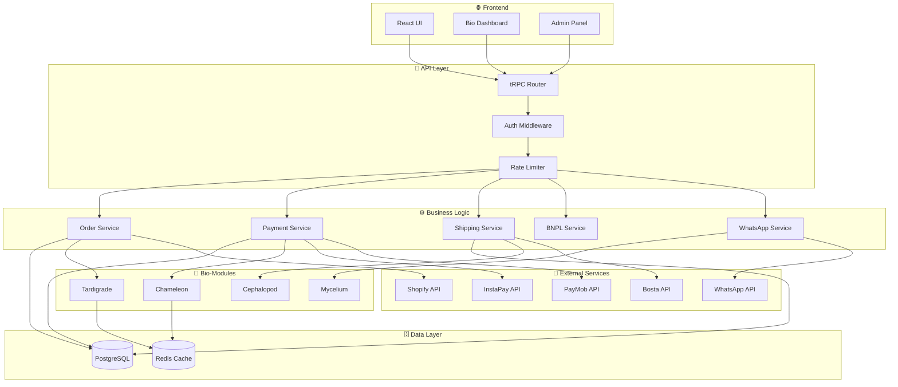

---

## 📦 دورة حياة الطلب (Order Lifecycle)

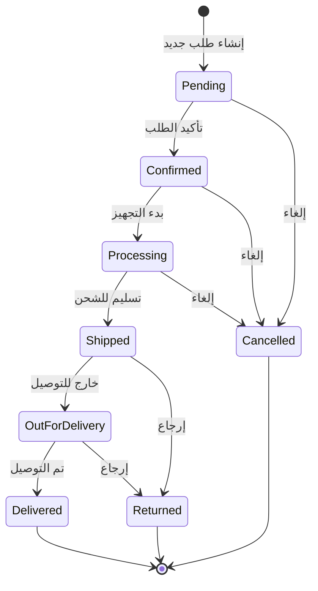

---

## 💳 مسار الدفع (Payment Flow)

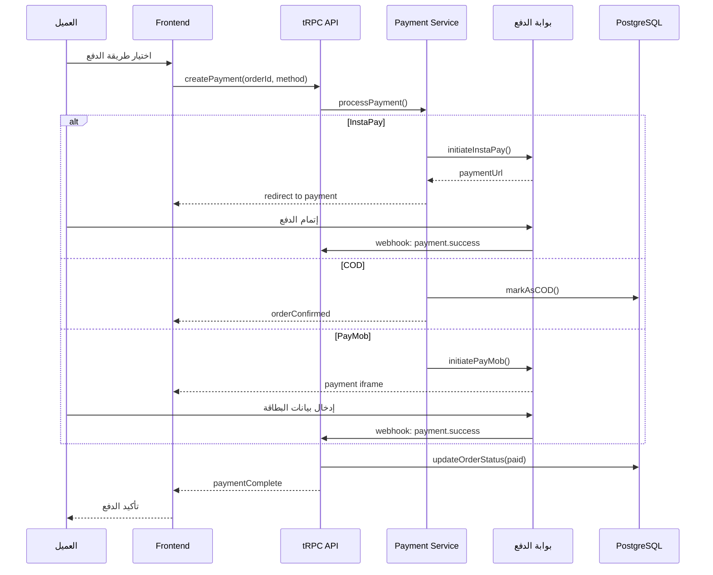

---

## 🚚 مسار الشحن (Shipping Flow)

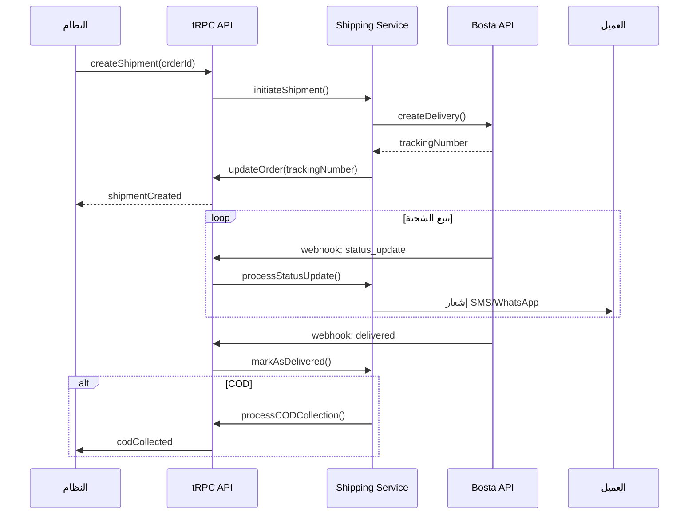

---

## 🧬 Bio-Modules Architecture

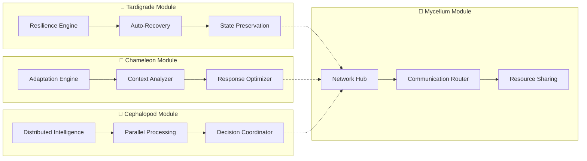

---

## 📱 WhatsApp Commerce Flow

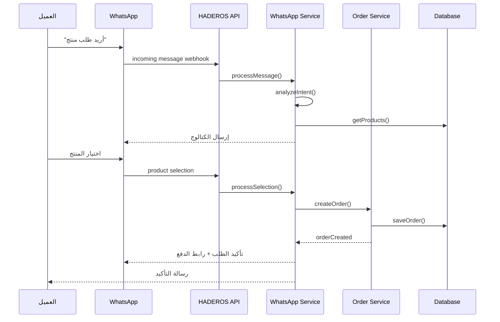

---

## 💰 BNPL (التقسيط) Flow

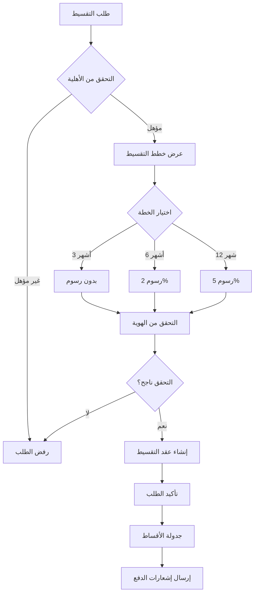

---

## 🏪 Shopify Integration

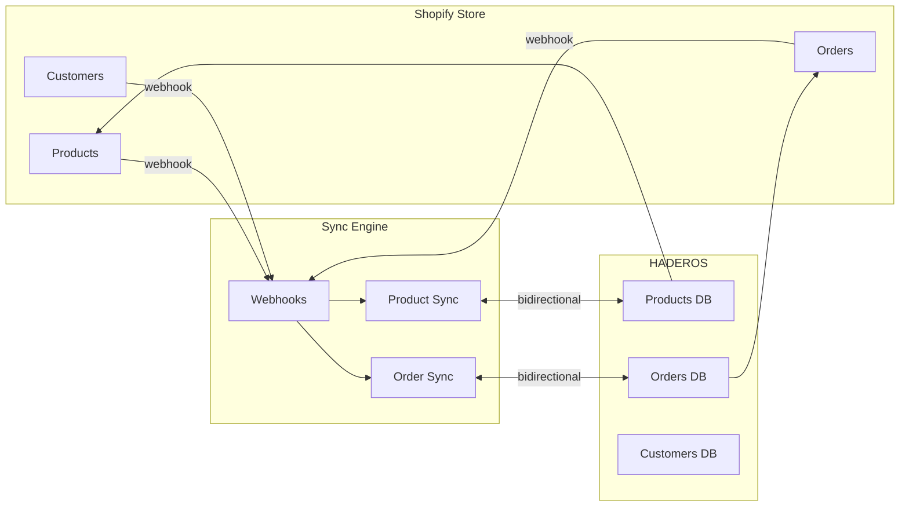

---

## 🔐 Authentication Flow

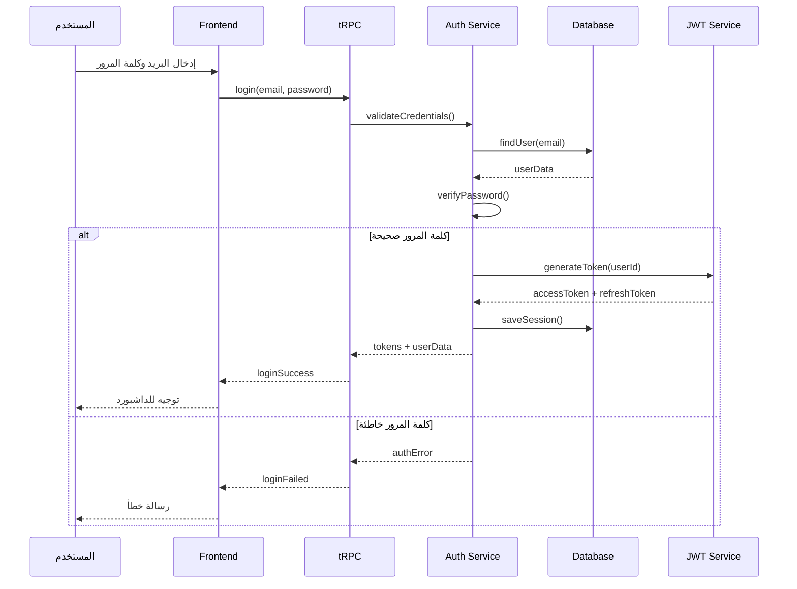

---

## 📊 Data Flow Overview

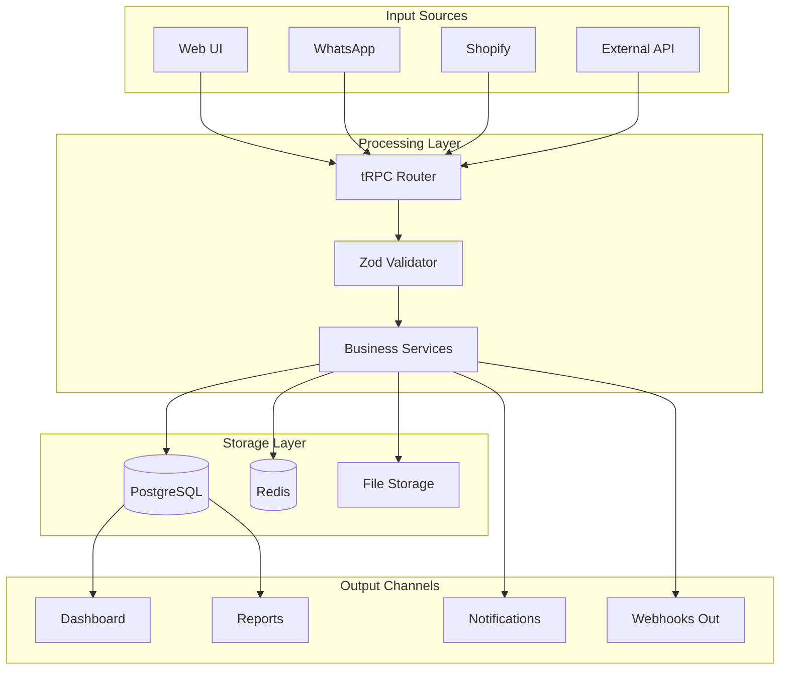

---

## 🌐 Deployment Architecture

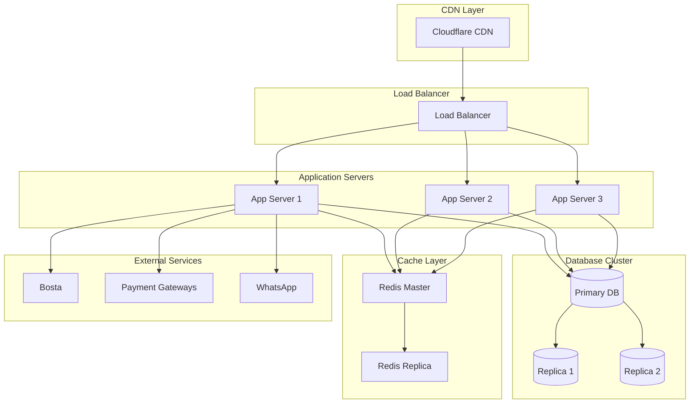

---

## 📈 Monitoring & Observability

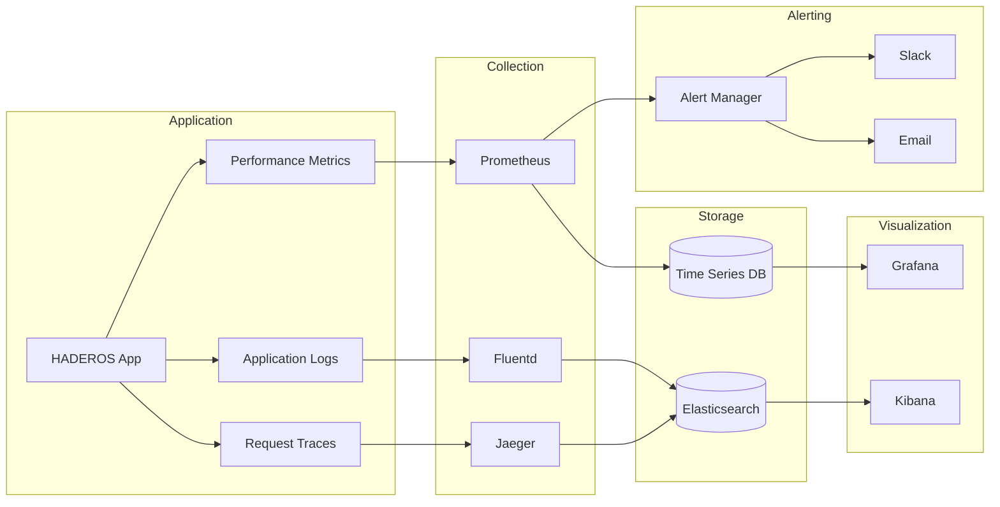

---

## 💡 كيفية استخدام المخططات

### في GitHub
المخططات ستُعرض تلقائياً في GitHub لأنه يدعم Mermaid.

### في VS Code
ثبّت إضافة **Markdown Preview Mermaid Support**.

### في التطبيق
استخدم مكتبة `mermaid` في React:
```tsx
import mermaid from 'mermaid';

useEffect(() => {
  mermaid.initialize({ startOnLoad: true });
  mermaid.contentLoaded();
}, []);
```

---

**HADEROS AI Cloud** - مخططات البنية v1.0.0
