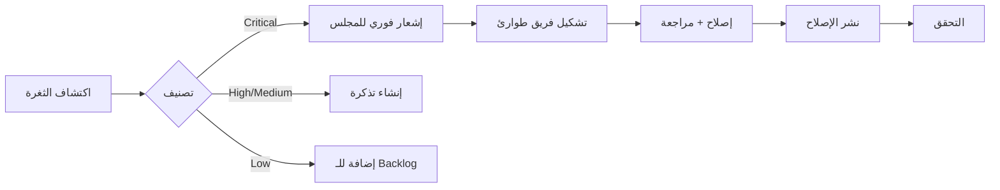

# 🛡️ سياسة أمن المعلومات المؤسسية - HADEROS
## Enterprise Information Security Policy (ISP)

**الإصدار:** 1.0
**تاريخ السريان:** 2025-01-01
**المراجعة القادمة:** 2025-07-01
**المالك:** مجلس الأمن والجودة
**التصنيف:** سري - للاستخدام الداخلي

---

## 1. المقدمة والغرض

### 1.1 الغرض
تُحدد هذه السياسة الإطار الأمني الشامل لنظام HADEROS، وتُعتبر **جزءاً لا يتجزأ من مواصفات المنتج النهائي** وليست مهمة فنية إضافية.

### 1.2 النطاق
تنطبق هذه السياسة على:
- جميع أعضاء فريق التطوير والعمليات
- جميع المتعاقدين والشركاء الذين يصلون للنظام
- جميع البيئات: التطوير، الاختبار، الإنتاج
- جميع البيانات المُعالجة بواسطة النظام

### 1.3 الالتزام
**عدم الامتثال لهذه السياسة قد يؤدي إلى:**
- رفض الشراء من الشركات الكبرى
- فقدان الثقة المؤسسية
- تعطيل عمليات النشر

---

## 2. مجلس الأمن والجودة (Security & Quality Council)

### 2.1 التكوين
| الدور | المسؤولية | السلطة |
|------|----------|-------|
| **مسؤول أمن النظام (Security Lead)** | إدارة المخاطر الأمنية، مراجعة الثغرات | إيقاف النشر عند وجود ثغرات حرجة |
| **مسؤول الجودة (QA/DevOps Lead)** | ضمان جودة الكود، إدارة CI/CD | رفض الـ merge عند فشل الاختبارات |
| **المهندس المعماري الرئيسي (Lead Architect)** | مراجعة القرارات المعمارية | الموافقة على التغييرات الهيكلية |

### 2.2 اجتماعات المجلس
- **أسبوعياً:** مراجعة سريعة للمخاطر (30 دقيقة)
- **شهرياً:** مراجعة شاملة للسياسات (2 ساعة)
- **ربع سنوي:** تدقيق ذاتي كامل

### 2.3 سلطة الإيقاف
**المجلس مخوّل بـ:**
- إيقاف أي نشر لا يلبي المعايير
- طلب إصلاحات فورية للثغرات الحرجة
- تعليق الوصول لأي مستخدم مخالف

---

## 3. الأساسيات الحديدية (Non-Negotiables)

### 3.1 الهوية والوصول (Identity & Access)

#### 3.1.1 المصادقة متعددة العوامل (MFA)
```
✅ إجباري لجميع المستخدمين
✅ إجباري للوصول للإنتاج
✅ إجباري لـ GitHub/Git operations
✅ إجباري للوصول لقاعدة البيانات
```

#### 3.1.2 الحد الأدنى من الامتيازات (Principle of Least Privilege - PoLP)
| الدور | الصلاحيات المسموحة | الصلاحيات الممنوعة |
|------|-------------------|------------------|
| Developer | قراءة/كتابة الكود، بيئة التطوير | الوصول للإنتاج مباشرة |
| DevOps | إدارة CI/CD، النشر | تعديل الكود مباشرة |
| Admin | إدارة الصلاحيات | الوصول للبيانات الشخصية بدون تسجيل |
| Security | مراجعة السجلات، فحص الثغرات | تعديل الكود |

#### 3.1.3 إدارة الجلسات
- انتهاء الجلسة: 8 ساعات كحد أقصى
- الجلسة الخاملة: 30 دقيقة
- تسجيل خروج إجباري عند تغيير الصلاحيات

### 3.2 التشفير (Encryption)

#### 3.2.1 التشفير أثناء النقل
```yaml
البروتوكول: TLS 1.3 (إجباري)
TLS 1.2: مسموح مع تحذير
TLS 1.1 وأقل: ممنوع تماماً
الشهادات: Let's Encrypt أو شهادات مؤسسية
```

#### 3.2.2 التشفير أثناء التخزين
```yaml
البيانات الحساسة: AES-256-GCM
مفاتيح التشفير: مُدارة منفصلة (Key Management Service)
كلمات المرور: bcrypt (cost factor 12+)
المفاتيح السرية: HashiCorp Vault أو AWS KMS
```

#### 3.2.3 البيانات المطلوب تشفيرها
- ✅ كلمات المرور
- ✅ مفاتيح API
- ✅ بيانات الدفع
- ✅ البيانات الشخصية (PII)
- ✅ السجلات الطبية (إن وجدت)

### 3.3 المراقبة والتسجيل (Monitoring & Logging)

#### 3.3.1 الأحداث المطلوب تسجيلها
```
🔐 Authentication Events:
   - محاولات تسجيل الدخول (ناجحة/فاشلة)
   - تغيير كلمة المرور
   - تفعيل/تعطيل MFA

👤 Authorization Events:
   - تغيير الصلاحيات
   - الوصول لموارد محمية
   - رفض الوصول

📊 Data Events:
   - الوصول للبيانات الحساسة
   - تصدير البيانات
   - حذف البيانات

⚙️ System Events:
   - تشغيل/إيقاف الخدمات
   - تغييرات التكوين
   - أخطاء النظام الحرجة
```

#### 3.3.2 متطلبات السجلات
| المتطلب | القيمة |
|--------|-------|
| مدة الاحتفاظ | سنة واحدة كحد أدنى |
| التخزين | مشفر ومنفصل عن النظام الرئيسي |
| الوصول | محدود لفريق الأمن فقط |
| التنسيق | JSON مع timestamps UTC |

#### 3.3.3 SIEM Integration
```yaml
النظام المقترح: Elasticsearch + Kibana أو Splunk
التنبيهات:
  - محاولات دخول فاشلة متكررة (>5 في 10 دقائق)
  - وصول غير معتاد خارج ساعات العمل
  - تصدير كميات كبيرة من البيانات
  - تغييرات في الصلاحيات
```

---

## 4. أمان CI/CD (Security Gates)

### 4.1 البوابات الإجبارية

```yaml
# لا يمكن تخطي هذه الخطوات
security_gates:
  - name: "SAST (Static Application Security Testing)"
    tool: "CodeQL / Snyk Code"
    fail_on: "critical, high"
    required: true

  - name: "SCA (Software Composition Analysis)"
    tool: "Snyk / npm audit"
    fail_on: "critical"
    required: true

  - name: "Secret Scanning"
    tool: "TruffleHog / GitLeaks"
    fail_on: "any secret detected"
    required: true

  - name: "DAST (Dynamic Application Security Testing)"
    tool: "OWASP ZAP"
    target: "staging environment"
    required: true

  - name: "Container Scanning"
    tool: "Trivy"
    fail_on: "critical"
    required: true
```

### 4.2 قواعد الفشل التلقائي

```
❌ فشل البناء تلقائياً إذا:
   - ثغرة Critical في الكود
   - ثغرة Critical في التبعيات
   - مفتاح سري في الكود
   - فشل اختبارات الأمان
   - تغطية اختبارات أقل من 80%
```

### 4.3 الموافقات المطلوبة

| نوع التغيير | الموافقات المطلوبة |
|------------|------------------|
| تغيير عادي | مراجعة كود واحدة |
| تغيير API | مراجعتين + مراجعة أمنية |
| تغيير أمني | مجلس الأمن والجودة |
| نشر للإنتاج | DevOps Lead + Security Lead |

---

## 5. إدارة الثغرات (Vulnerability Management)

### 5.1 تصنيف الثغرات

| المستوى | الوصف | وقت الإصلاح |
|---------|-------|-------------|
| **Critical** | يسمح بالتحكم الكامل أو تسريب بيانات واسع | 24 ساعة |
| **High** | يسمح بالوصول غير المصرح به | 7 أيام |
| **Medium** | قد يؤدي لتسريب معلومات محدودة | 30 يوماً |
| **Low** | تأثير محدود | 90 يوماً |

### 5.2 عملية المعالجة



### 5.3 الفحص الدوري
- **يومياً:** فحص التبعيات التلقائي في CI/CD
- **أسبوعياً:** مراجعة نتائج الفحص
- **شهرياً:** فحص شامل بأدوات خارجية
- **ربع سنوي:** اختبار اختراق

---

## 6. حماية البيانات (Data Protection)

### 6.1 تصنيف البيانات

| التصنيف | الوصف | أمثلة | الحماية |
|---------|-------|------|---------|
| **سري للغاية** | بيانات حرجة للأعمال | مفاتيح التشفير، أسرار تجارية | تشفير + وصول محدود جداً |
| **سري** | بيانات حساسة | بيانات العملاء، بيانات مالية | تشفير + تسجيل الوصول |
| **داخلي** | للاستخدام الداخلي | وثائق العمليات، الكود | وصول مصرّح به |
| **عام** | يمكن نشره | التوثيق العام، الموقع | لا قيود |

### 6.2 حماية البيانات الشخصية (PII)

```yaml
المبادئ:
  - جمع الحد الأدنى الضروري
  - الاحتفاظ لأقصر مدة ممكنة
  - تشفير أثناء النقل والتخزين
  - حق الحذف (Right to be Forgotten)

الإجراءات:
  - تسجيل كل وصول للـ PII
  - إخفاء الهوية في بيئات التطوير
  - لا PII في السجلات (logs)
```

---

## 7. الامتثال والتدقيق (Compliance & Audit)

### 7.1 المعايير المستهدفة

| المعيار | الحالة | الأولوية |
|--------|-------|---------|
| OWASP Top 10 | ✅ مطبق | حرجة |
| CIS Benchmarks | 🔄 قيد التطبيق | عالية |
| SOC 2 Type II | 📋 مخطط | متوسطة |
| ISO 27001 | 📋 مخطط | متوسطة |

### 7.2 سجلات التدقيق

```yaml
المتطلبات:
  - الاحتفاظ: سنة كاملة
  - التنسيق: JSON موحد
  - التخزين: منفصل ومشفر
  - الوصول: فريق الأمن فقط

المحتوى:
  - من (who): هوية المستخدم
  - ماذا (what): العملية المنفذة
  - متى (when): الوقت بـ UTC
  - أين (where): المورد المستهدف
  - كيف (how): طريقة الوصول
  - النتيجة (result): نجاح/فشل
```

### 7.3 جاهزية التدقيق الخارجي

**الوثائق المطلوبة:**
- ☐ سياسة أمن المعلومات (هذا المستند)
- ☐ خطة الاستجابة للحوادث (IRP)
- ☐ خطة استعادة الكوارث (DRP)
- ☐ سياسة تصنيف البيانات
- ☐ سجلات الفحوصات الأمنية
- ☐ نتائج اختبارات الاختراق
- ☐ سجلات التدريب الأمني

---

## 8. التدريب والتوعية

### 8.1 التدريب الإجباري

| الموضوع | التكرار | المستهدفون |
|--------|---------|----------|
| الوعي الأمني الأساسي | سنوياً | الجميع |
| البرمجة الآمنة | كل 6 أشهر | المطورون |
| الاستجابة للحوادث | سنوياً | الفريق التقني |
| حماية البيانات | سنوياً | الجميع |

### 8.2 تمارين المحاكاة
- **ربع سنوي:** تمرين استجابة للحوادث
- **نصف سنوي:** اختبار استعادة الكوارث
- **سنوي:** محاكاة اختراق كاملة

---

## 9. المراجعة والتحديث

### 9.1 جدول المراجعة
- **ربع سنوي:** مراجعة فعالية السياسة
- **نصف سنوي:** تحديث بناءً على التهديدات الجديدة
- **سنوي:** مراجعة شاملة وتحديث

### 9.2 محفزات التحديث الفوري
- حادث أمني كبير
- تغيير كبير في البنية التحتية
- متطلبات امتثال جديدة
- اكتشاف ثغرة حرجة جديدة

---

## 10. التواقيع والموافقات

| الدور | الاسم | التوقيع | التاريخ |
|------|------|--------|--------|
| Security Lead | | | |
| QA/DevOps Lead | | | |
| Lead Architect | | | |
| CEO/CTO | | | |

---

## الملاحق

### ملحق أ: قائمة الأدوات المعتمدة
- SAST: CodeQL, Snyk Code
- SCA: Snyk, npm audit
- DAST: OWASP ZAP
- Container Scanning: Trivy
- Secret Scanning: TruffleHog, GitLeaks
- SIEM: Elasticsearch/Kibana أو Splunk
- Key Management: HashiCorp Vault, AWS KMS

### ملحق ب: جهات الاتصال
- البريد الأمني: security@haderos.io
- الطوارئ: [رقم الهاتف]
- مجلس الأمن: [قائمة التوزيع]

### ملحق ج: المراجع
- OWASP Top 10: https://owasp.org/Top10/
- CIS Benchmarks: https://www.cisecurity.org/cis-benchmarks
- NIST Cybersecurity Framework: https://www.nist.gov/cyberframework

---

**تذكير نهائي:**
> هذه السياسة ليست مجرد وثيقة - إنها **جزء من مواصفات المنتج**.
> نقاط الفشل في أي عنصر = رفض الشراء من الشركات الكبرى.
