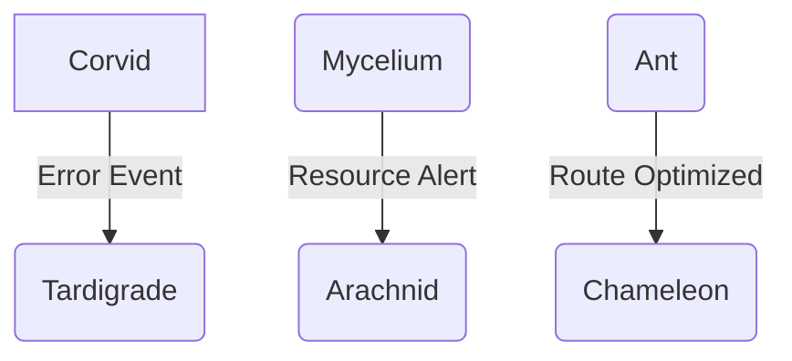

# HaderOS - تصميم لوحة المراقبة التفاعلية

**الهدف:** توفير رؤية شاملة في الوقت الفعلي لتفاعل الوحدات الحيوية، وليس فقط عرض إحصائيات.

---

## 1. 🎯 الفلسفة التصميمية

- **من "ماذا حدث؟" إلى "لماذا يحدث؟"**: التركيز على العلاقات والسببية بين الأحداث.
- **من "البيانات" إلى "الرؤى"**: تحويل الأرقام إلى رؤى قابلة للتنفيذ.
- **من "المراقبة" إلى "القيادة"**: تمكين القادة من اتخاذ قرارات استراتيجية بناءً على سلوك النظام.

---

## 2. 📊 مكونات لوحة المراقبة

### المكون 1: خريطة النظام العصبي (Nervous System Map)

**الوصف:** عرض مرئي ديناميكي يوضح تدفق الأحداث بين الوحدات الحيوية.

**الشكل:**
- كل وحدة حيوية ممثلة بدائرة (Node).
- حجم الدائرة يمثل عدد الاستدعاءات في آخر ساعة.
- الخطوط بين الدوائر تمثل الأحداث (Events).
- سمك الخط يمثل عدد الأحداث.
- لون الخط يمثل نوع الحد (أخضر = نجاح، أحمر = فشل، أصفر = تحذير).

**التفاعل:**
- عند النقر على دائرة (وحدة)، تظهر إحصائياتها التفصيلية.
- عند النقر على خط (حدث)، يظهر سجل الأحداث.

**مثال:**

---

### المكون 2: مؤشر الصحة الحيوية (Bio-Health Index)

**الوصف:** مؤشر واحد يجمع صحة جميع الوحدات الحيوية في رقم واحد (0-100%).

**الحساب:**
- يتم حساب درجة صحة لكل وحدة بناءً على:
  - معدل النجاح
  - وقت الاستجابة
  - استخدام الموارد
- يتم تجميع الدرجات في مؤشر واحد مع أوزان مختلفة.

**العرض:**
- عرض كبير وواضح في أعلى لوحة المراقبة.
- يتغير لونه من الأخضر إلى الأحمر بناءً على القيمة.

---

### المكون 3: سجل القرارات الاستراتيجية (Strategic Decision Log)

**الوصف:** سجل غير قابل للتعديل لجميع القرارات الهامة التي اتخذها النظام.

**المحتوى:**
| الوقت | الوحدة | القرار | السبب | التأثير المتوقع |
| :--- | :--- | :--- | :--- | :--- |
| 10:30 | Chameleon | رفع سعر المنتج X بنسبة 5% | زيادة الطلب | +$5,000 إيرادات |
| 10:35 | Arachnid | تجميد حساب المستخدم Y | محاولة تصدير بيانات | حماية البيانات |
| 10:40 | Mycelium | نقل 100 وحدة من فرع A إلى B | عجز في المخزون | تلبية الطلبات |

**الفلترة:**
- يمكن فلترة السجل حسب الوحدة، نوع القرار، أو مستوى الأهمية.

---

### المكون 4: محاكي المستقبل (Future Simulator)

**الوصف:** أداة تفاعلية تسمح للقادة باختبار سيناريوهات "ماذا لو".

**الاستخدام:**
1. يختار القائد سيناريو (مثلاً: "انقطاع شركة شحن").
2. يقوم المحاكي بتشغيل السيناريو على بيانات تاريخية.
3. يعرض النتائج المتوقعة وكيف سيتصرف النظام.

**الفائدة:**
- اختبار الاستراتيجيات قبل تطبيقها.
- تدريب النظام على سيناريوهات جديدة.
- فهم أعمق لسلوك النظام.

---

## 3. 🛠️ التقنيات المقترحة

| المكون | التقنية |
| :--- | :--- |
| **الواجهة الأمامية** | React + TypeScript |
| **الرسوم البيانية** | D3.js أو Vis.js |
| **البيانات في الوقت الفعلي** | WebSockets أو Server-Sent Events |
| **الخلفية** | Node.js + tRPC |
| **قاعدة البيانات** | TimescaleDB (لبيانات السلاسل الزمنية) |

---

## 4. 🚀 خطة التنفيذ

### المرحلة 1: MVP (أسبوعان)
- بناء المكونين 1 و 2 (خريطة النظام العصبي ومؤشر الصحة الحيوية).
- ربطهما ببيانات وهمية.

### المرحلة 2: الإصدار الأول (4 أسابيع)
- ربط MVP ببيانات حقيقية.
- بناء المكون 3 (سجل القرارات الاستراتيجية).

### المرحلة 3: الإصدار الكامل (6 أسابيع)
- بناء المكون 4 (محاكي المستقبل).
- تحسين الأداء والتصميم.
